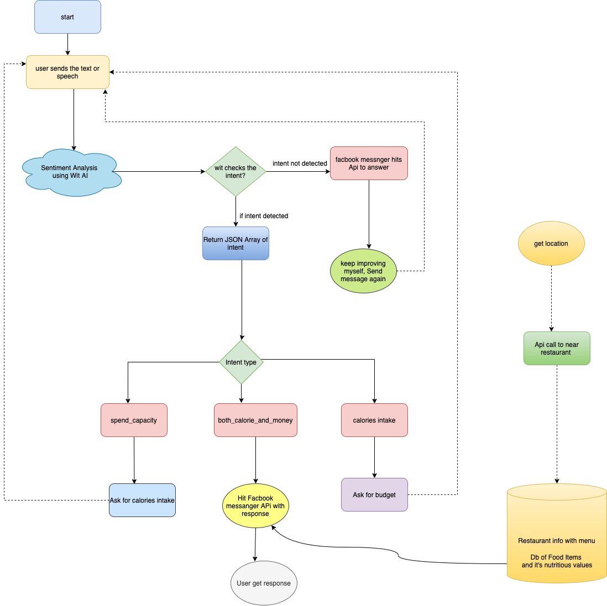

# Restropedia

A publically Available messanger bot build during Facebook Refresh F8 2021 Hackathon which takes care of your buget and calories intake.

- Features:
  - Speak it or type it
  - Recomment perfect food within your calories intake and budget.
  - Suggests nearby Restaurants.
  - uses Wit.ai powerful engine to extract sentiments.

- Architecture Diagram:  
  

- Watch our working demo on youtube [here](https://www.youtube.com/watch?v=aCJPjawnk6A)
- Want to talk to our bot it is live here : https://skimpindiet.herokuapp.com/

- Contributors:
  - Ashwin kulkarni (ashwin.kulkarni128@gmail.com)
  - Hardik Dadhich (dadhichhardik26@gmail.com)

- Terms and Conditions:
  - Avoid using creds exposed in code. That voilates our code of conduct. We are Highly recomment you to generate new.
  - generate your Wit.Ai [creds](https://wit.ai/) and FB creds and replace them with your values.
